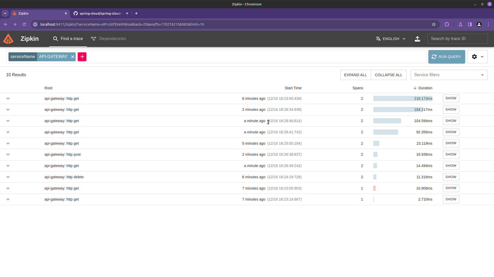
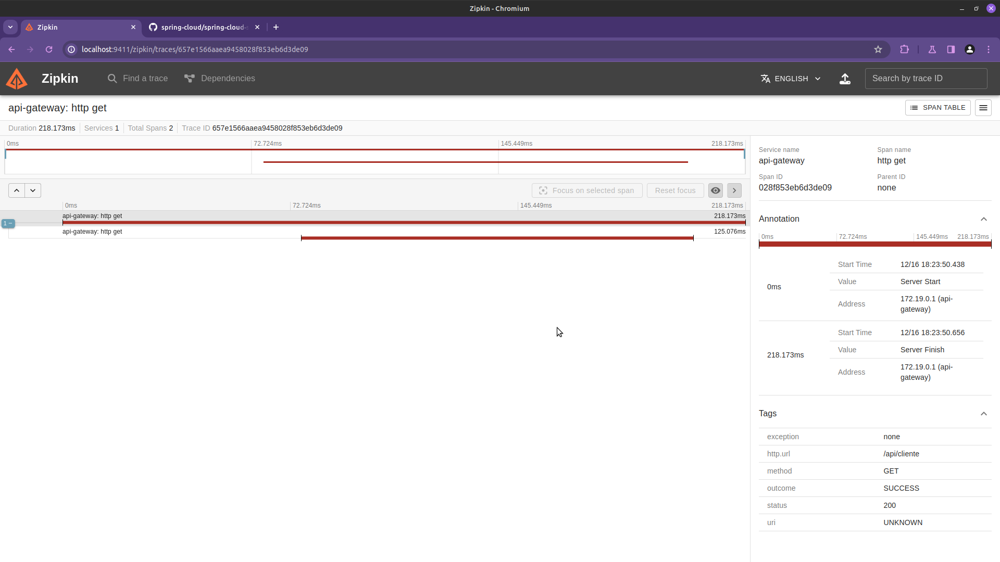
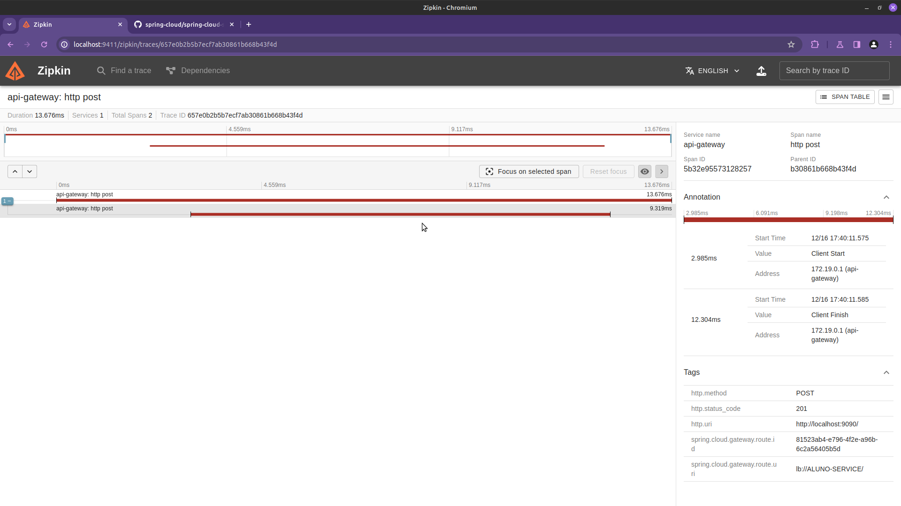

# API-Gateway

Projeto de Microsserviços com Java Spring Cloud - API Gateway.
Trabalho da pós-graduação do Instituto INFNET - Matéria de Microsserviços.

## 💻 Pré-requisitos

Antes de começar, verifique se você atendeu aos seguintes requisitos:
* Ter instalada a versão do Java JDK 17 ou superior;
* Ter instalado o Apache Maven 3.x.x;
* Utilizar uma IDE para Java - Eclipse, IntelliJ ou Visual Studio Code;
* Possuir o Docker + Docker Compose devidamente instalados em sua máquina.

## 🚀 Realizando o Setup

1. Clone o repositório;

2. Execute o comando para iniciar a aplicação:
```bash
mvn clean && mvn spring-boot:run
```
3. O serviço roda na porta: 9090.

4. As APIs que serão geridas pelo API-GATEWAY estão no projeto:

API 1:
https://github.com/npmltech/Mini-Projeto-Spring

API 2:
https://github.com/npmltech/About-Microservices-Java

## 🔍 Zipkin como recurso de rastreamento

Quem fica responsável por realizar a rastreabilidade dos microsserviços será a API-GATEWAY.

- Para utilizar o **Zipkin**, basta executar o docker que se encontra na pasta **zipkin-docker**;
- Para acessar o **Zipkin**, o endereço é: http://localhost:9411/zipkin;
- Na busca, indique o nome dos serviços: CLIENTE_SERVICE e ALUNO_SERVICE.

Imagens com a monitoração dos microsserviços usando **Zipkin**.





